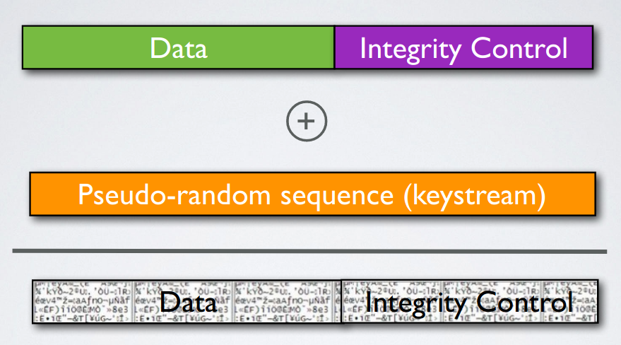

# Sécurité des réseaux sans fil

## Laboratoire 802.11 Sécurité WEP

### 1. Déchiffrement manuel de WEP

Dans cette partie, vous allez récupérer le script Python `manual-decryption.py`. Il vous faudra également le fichier de capture `arp.cap` contenant un message arp chiffré avec WEP et la librairie `rc4.py` pour générer les keystreams indispensables pour chiffrer/déchiffrer WEP. Tous les fichiers doivent être copiés dans le même répertoire local sur vos machines.

- Ouvrir le fichier de capture `arp.cap` avec Wireshark
- Utiliser Wireshark pour déchiffrer la capture. Pour cela, il faut configurer dans Wireshark la clé de chiffrement/déchiffrement WEP (Dans Wireshark : Preferences&rarr;Protocols&rarr;IEEE 802.11&rarr;Decryption Keys). Il faut également activer le déchiffrement dans la fenêtre IEEE 802.11 (« Enable decryption »). Vous trouverez la clé dans le script Python `manual-decryption.py`.
- Exécuter le script avec `python manual-decryption.py`
- Comparer la sortie du script avec la capture text déchiffrée par Wireshark
- Analyser le fonctionnement du script

> Lorsque nous déchiffrons la capture Wireshark grâce à la clé, nous obtenons ceci :
>
> 
>
> Sur cette image, nous pouvons voir que nous avons des informations liées à WEP. Nous avons l'IV, l'index de la clé ainsi que l'ICV. 
>
> Une fois le script executé, nous avons obtenu ceci :
>
> 
>
> Nous pouvons remarquer que le texte retourné par le script correspond au message de la trame Wireshark (en hexadecimal). Aussi, lorsque nous activons le déchiffrement de la trame dans Wireshark, les paramètres WEP ne sont pas déchiffrés. Nous avons donc ajouté dans le script l'affichage de l'ICV chiffré afin de constater que les valeurs correspondent bien.
>
> En ce qui concerne le script, il effectue les étapes suivantes :
>
> 1. Recupération du premier paquet de la capture `arp.cap`
> 2. Création de la seed qui sera utilisé par RC4. Cette seed est composée de l'IV, récupérée de la capture, et de la clé WEP qui est connue.
> 3. Récupération de l'ICV (encore chiffré) de la trame.
> 4. Concaténation des datas du paquet avec l'ICV afin d'obtenir l'ensemble des données qui ont été chiffrées (bloc du bas sur cette capture)
> 5. Déchiffrement du bloc grâce au keystream. Pour ce faire, le script va instancier un objet RC4 en lui donnant la seed précédemment construite. Pour déchiffrer les données, il va suffir de XOR les données chiffrées avec le keystream. En effet, étant donné que la seed est la même (car composée de l'IV et de la clé) que lorsque les données ont été chiffrées, cette oprération va nous permettre de récuperer les données claires.

### 2. Chiffrement manuel de WEP

Utilisant le script `manual-decryption.py` comme guide, créer un nouveau script `manual-encryption.py` capable de chiffrer un message, l’enregistrer dans un fichier pcap et l’envoyer.
Vous devrez donc créer votre message, calculer le contrôle d’intégrité (ICV), et les chiffrer (voir slides du cours pour les détails).

> Voici la capture importée dans Wireshark. Nous avons modifié le message de l'exercice 1 en changeant l'adresse IP effectuant la requête ARP (192.168.1.100 est devenu 192.168.1.102).
>
> 
>
> Le fichier cap se trouve ici : [files/task2.cap](files/task2.cap)

### 3. Fragmentation

Dans cette partie, vous allez enrichir votre script développé dans la partie précédente pour chiffrer 3 fragments.

> Voici la capture Wireshark avec nos 3 segments. Nous pouvons voir que le message reconstitué est bien celui que nous avions écrit dans le script. De plus, nous pouvons voir que Wireshark nous montre que les 3 paquets sont liés à l'aide des points dans la colonne "No."
>
> 
>
> Le fichier cap se trouve ici : [files/task3.cap](files/task3.cap)
